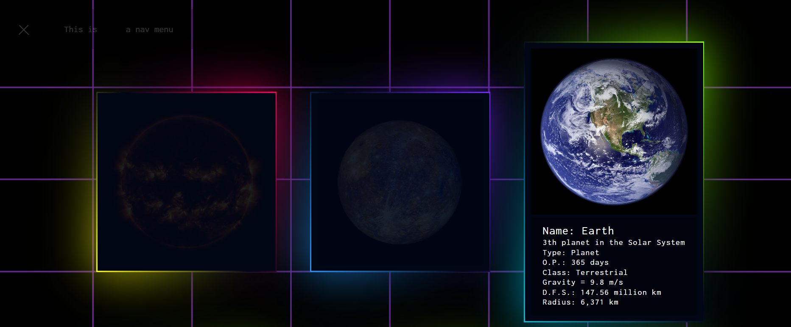

# Scards - The Most Famous Objects in the Solar System

Explore the most famous objects in the Solar System with Scards, a web application built using HTML, CSS, and JavaScript.

## Description

Scards is a visually appealing web application that provides information about various celestial objects in the Solar System. Each object is presented in a card format, showcasing stunning images and essential details.

## Preview

## Features

- Mobile-responsive navigation menu.
- Interactive card layout for each celestial object.
- Engaging hover effects for enhanced user experience.
- Informative details about the Sun, planets, and artificial satellites.
- Background image changes dynamically for a captivating design.

